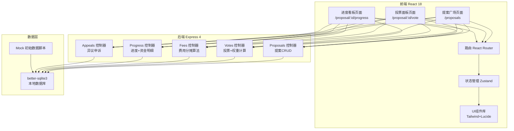
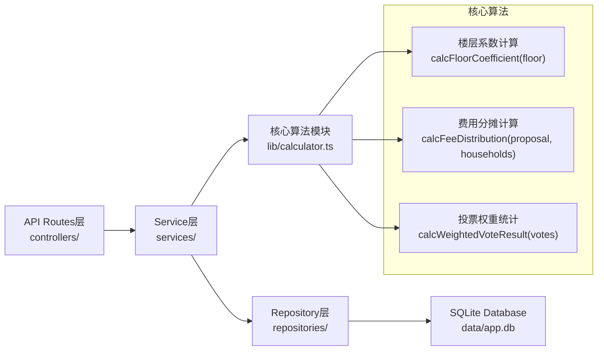
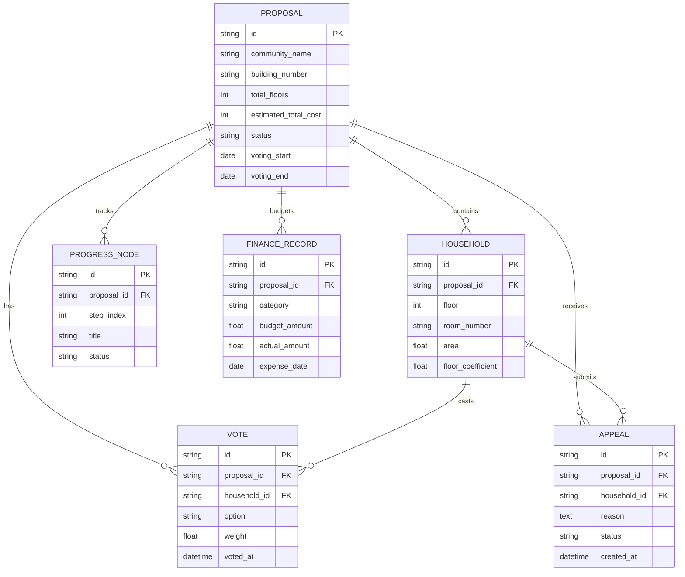

## 1. 架构设计



## 2. 技术描述

- **前端**：React@18 + TypeScript + Vite + TailwindCSS@3 + Zustand + React Router DOM@6 + Lucide React
- **初始化工具**：vite-init (react-express-ts 模板)
- **后端**：Express@4 + TypeScript + better-sqlite3
- **数据库**：SQLite（本地文件存储，便于演示部署）
- **包管理器**：npm（若环境支持 pnpm 则优先使用 pnpm）

## 3. 路由定义

| 前端路由 | 页面用途 |
|---------|---------|
| `/` | 重定向至 `/proposals` |
| `/proposals` | 提案广场首页，列表+筛选+搜索+发起入口 |
| `/proposal/:id/vote` | 投票面板：身份选择+费用表+投票操作+结果展示+申诉 |
| `/proposal/:id/progress` | 进度看板：施工时间轴+资金使用明细 |

| 后端API路由 | 方法 | 用途 |
|-----------|------|------|
| `/api/proposals` | GET | 获取提案列表（支持状态筛选、搜索） |
| `/api/proposals` | POST | 发起新提案 |
| `/api/proposals/:id` | GET | 获取提案详情 |
| `/api/proposals/:id/fee-estimate` | GET | 获取该提案的费用分摊明细表 |
| `/api/votes` | POST | 提交投票（含房号、选项、自动计算权重） |
| `/api/proposals/:id/vote-result` | GET | 获取投票统计结果（加权+非加权） |
| `/api/appeals` | POST | 提交异议申诉 |
| `/api/proposals/:id/appeals` | GET | 获取申诉列表 |
| `/api/proposals/:id/progress` | GET | 获取施工进度节点列表 |
| `/api/proposals/:id/progress/:nodeId` | PUT | 更新进度节点状态 |
| `/api/proposals/:id/finances` | GET | 获取资金使用明细 |
| `/api/finances` | POST | 新增资金支出记录 |

## 4. API 类型定义

```typescript
// 共享类型定义 shared/types.ts
export type ProposalStatus = 'voting' | 'public_notice' | 'appealing' | 'approved' | 'construction' | 'completed' | 'rejected';

export type VoteOption = 'agree' | 'disagree' | 'abstain';

export type ProgressNodeStatus = 'pending' | 'in_progress' | 'completed';

export interface Household {
  id: string;
  proposalId: string;
  building: string;
  unit: string;
  floor: number;
  roomNumber: string;
  area: number; // 建筑面积㎡
}

export interface Proposal {
  id: string;
  communityName: string;
  buildingNumber: string;
  totalFloors: number;
  unitsCount: number;
  householdsPerUnit: number;
  totalHouseholds: number;
  estimatedTotalCost: number; // 预估总价（元）
  elevatorPlan: string;
  estimatedDuration: number; // 预估工期（天）
  initiator: string;
  status: ProposalStatus;
  votingStartDate: string;
  votingEndDate: string;
  createdAt: string;
}

export interface FeeEstimateItem {
  householdId: string;
  floor: number;
  roomNumber: string;
  area: number;
  floorCoefficient: number; // 楼层系数
  weightFactor: number; // 权重因子 = 系数 × 面积
  estimatedFee: number; // 分摊金额
  percentage: number; // 占比%
}

export interface VoteRecord {
  id: string;
  proposalId: string;
  householdId: string;
  option: VoteOption;
  weight: number; // 投票权重（=楼层系数）
  votedAt: string;
}

export interface VoteResult {
  totalHouseholds: number;
  votedCount: number;
  votingRate: number; // 投票率
  agreeCount: number;
  disagreeCount: number;
  abstainCount: number;
  weightedAgree: number;
  weightedDisagree: number;
  weightedAbstain: number;
  weightedAgreeRate: number; // 加权同意率
  passed: boolean; // 是否通过（通常加权同意率≥2/3）
}

export interface Appeal {
  id: string;
  proposalId: string;
  householdId: string;
  reason: string;
  evidenceUrls?: string[];
  status: 'pending' | 'reviewed' | 'resolved' | 'rejected';
  createdAt: string;
  reply?: string;
}

export interface ProgressNode {
  id: string;
  proposalId: string;
  stepIndex: number;
  title: string;
  description: string;
  status: ProgressNodeStatus;
  startDate?: string;
  endDate?: string;
  responsible?: string;
  attachments?: { name: string; url: string }[];
}

export interface FinanceRecord {
  id: string;
  proposalId: string;
  category: 'design' | 'construction' | 'equipment' | 'inspection' | 'other';
  categoryName: string;
  description: string;
  budgetAmount: number;
  actualAmount: number;
  expenseDate: string;
  voucherUrl?: string;
}
```

## 5. 服务器架构图



**目录结构（后端api/）：**
```
api/
├── index.ts              # Express 入口
├── controllers/
│   ├── proposals.ts
│   ├── votes.ts
│   ├── fees.ts
│   ├── progress.ts
│   └── appeals.ts
├── services/
│   ├── proposalService.ts
│   ├── voteService.ts
│   └── progressService.ts
├── repositories/
│   ├── baseRepo.ts
│   ├── proposalRepo.ts
│   └── voteRepo.ts
├── lib/
│   ├── db.ts             # better-sqlite3 初始化
│   └── calculator.ts     # 核心算法：楼层系数、费用分摊、加权投票
├── data/
│   ├── schema.sql        # DDL建表语句
│   └── seed.ts           # Mock数据初始化脚本
└── middleware/
    └── errorHandler.ts
```

## 6. 数据模型

### 6.1 ER图



### 6.2 DDL建表语句

```sql
-- 提案表
CREATE TABLE IF NOT EXISTS proposals (
    id TEXT PRIMARY KEY,
    community_name TEXT NOT NULL,
    building_number TEXT NOT NULL,
    total_floors INTEGER NOT NULL,
    units_count INTEGER NOT NULL DEFAULT 1,
    households_per_unit INTEGER NOT NULL,
    total_households INTEGER NOT NULL,
    estimated_total_cost REAL NOT NULL,
    elevator_plan TEXT NOT NULL,
    estimated_duration INTEGER NOT NULL,
    initiator TEXT NOT NULL,
    status TEXT NOT NULL DEFAULT 'voting',
    voting_start_date TEXT NOT NULL,
    voting_end_date TEXT NOT NULL,
    created_at TEXT NOT NULL DEFAULT (datetime('now'))
);

-- 住户表
CREATE TABLE IF NOT EXISTS households (
    id TEXT PRIMARY KEY,
    proposal_id TEXT NOT NULL REFERENCES proposals(id),
    building TEXT NOT NULL,
    unit TEXT NOT NULL DEFAULT '1',
    floor INTEGER NOT NULL,
    room_number TEXT NOT NULL,
    area REAL NOT NULL,
    floor_coefficient REAL NOT NULL
);

-- 投票记录表
CREATE TABLE IF NOT EXISTS votes (
    id TEXT PRIMARY KEY,
    proposal_id TEXT NOT NULL REFERENCES proposals(id),
    household_id TEXT NOT NULL REFERENCES households(id),
    option TEXT NOT NULL CHECK (option IN ('agree','disagree','abstain')),
    weight REAL NOT NULL,
    voted_at TEXT NOT NULL DEFAULT (datetime('now')),
    UNIQUE(proposal_id, household_id)
);

-- 申诉表
CREATE TABLE IF NOT EXISTS appeals (
    id TEXT PRIMARY KEY,
    proposal_id TEXT NOT NULL REFERENCES proposals(id),
    household_id TEXT NOT NULL REFERENCES households(id),
    reason TEXT NOT NULL,
    status TEXT NOT NULL DEFAULT 'pending',
    reply TEXT,
    created_at TEXT NOT NULL DEFAULT (datetime('now'))
);

-- 进度节点表
CREATE TABLE IF NOT EXISTS progress_nodes (
    id TEXT PRIMARY KEY,
    proposal_id TEXT NOT NULL REFERENCES proposals(id),
    step_index INTEGER NOT NULL,
    title TEXT NOT NULL,
    description TEXT,
    status TEXT NOT NULL DEFAULT 'pending',
    start_date TEXT,
    end_date TEXT,
    responsible TEXT,
    attachments TEXT
);

-- 资金明细表
CREATE TABLE IF NOT EXISTS finance_records (
    id TEXT PRIMARY KEY,
    proposal_id TEXT NOT NULL REFERENCES proposals(id),
    category TEXT NOT NULL,
    category_name TEXT NOT NULL,
    description TEXT NOT NULL,
    budget_amount REAL NOT NULL,
    actual_amount REAL NOT NULL DEFAULT 0,
    expense_date TEXT,
    voucher_url TEXT
);
```

**楼层系数算法说明（calculator.ts核心）：**
- 1-2层：系数 = 0（或按约定的极低价，设0.05）
- 第3层起：每升高1层系数递增 0.1
- 基础系数：第3层 = 1.0，第4层 = 1.1，第5层 = 1.2，第6层 = 1.3，依此类推
- 每户权重因子 = 楼层系数 × 建筑面积
- 每户分摊金额 = 工程总造价 × (权重因子 ÷ 全楼权重因子之和)

**加权投票规则：**
- 同意票权重 = 该户楼层系数
- 反对票权重 = 该户楼层系数
- 弃权票不计入权重
- 通过条件：加权同意率 ≥ 2/3（66.67%）且 投票户数率 ≥ 50%
